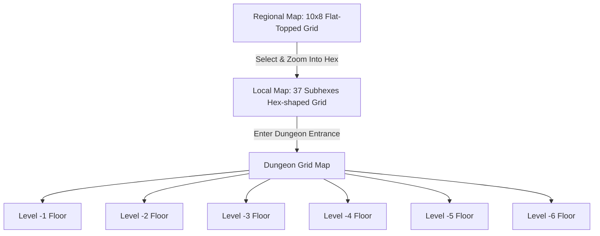

# VastDark: 3-Layer Procedural Hexcrawl Map Generator

A multi-scale, top-down mapping and exploration framework built with **Godot 4** and **C# (.NET)**. The project features procedurally generated hex layouts, vector outline drawing icons, a paper-like high-contrast aesthetic, and automatic map serialization.

---

## 🗺️ System Overview & Architecture

The mapping system is composed of **three nested layers** that scale down from a global landscape view to individual dungeon rooms.



### 1. Regional Scale
* **Dimensions**: Fixed grid of **10 columns wide by 8 rows high** (80 hexes).
* **Geometry**: **Flat-topped** hexagons. Staggered vertically by column.
* **Procedural Generation**:
  * Initializes the entire grid to **Wastes**.
  * Drops exactly **8 dice (D6s)** onto unique, non-overlapping hexes.
  * Resolves terrain based on the D6 roll:
    * **1**: Wastes
    * **2–4**: Ruins (spawns Ruins skyline outline icon)
    * **5–6**: Pillars (colored solid obsidian black)

### 2. Local Scale
* **Dimensions**: Hexagonal grid boundary composed of exactly **37 subhexes** (radius $R=3$, representing 1-mile units).
* **Geometry**: **Flat-topped** hexagons fitting within a 6-mile parent boundary.
* **Procedural Generation**:
  * First, rolls a D6 to determine the local density:
    * **1–3 (Barren)**: Drops **6 dice**
    * **4–5 (Standard)**: Drops **12 dice**
    * **6 (Plentiful)**: Drops **32 dice**
  * Allocates dice to unique random subhexes.
  * Resolves subhex biomes using the **Local Sub-Table** based on the parent regional hex type:
    
    | D6 Roll | Parent is RUINS | Parent is WASTES |
    | :---: | :--- | :--- |
    | **1** | Wastes | Wastes |
    | **2–4** | Ruins | Wastes |
    | **5** | Settlements | Wastes |
    | **6** | Settlements | Ruins |

  * All other subhexes default to **Wastes**.
  * If the parent regional hex is **Pillars**, the local map is filled entirely with massive columns.
  * A **Dungeon Entrance** is guaranteed at the center `(0,0)` of a Ruins local subgrid.

### 3. Dungeon Scale
* **Dimensions**: $24 \times 18$ grid layout supporting **6 vertical levels** (Floor -1 to Floor -6).
* **Features**: Rooms, corridors, heavy doors, stairs up/down, loot chests, and encounters.

---

## 🎨 Aesthetics & Vector Drawing
The game draws custom outlines directly using Godot's C# 2D drawing API (`_Draw()`) for a clean, high-contrast print/paper look:
* **Background**: Soft Off-White (`#eef2f7`)
* **Hex Borders**: Soft Periwinkle Blue (`#b2c2d8`)
* **Wastes & Ruins Fills**: Pure White (`#ffffff`)
* **Pillars Fill**: Solid Black (`#111215`)
* **Ruins Marker**: Black outlined multi-spire building skyline.
* **Settlements Marker**: Black outlined building skyline with a **waving black flag** on the left-most tower.

---

## 💾 Map Serialization & Auto-Save
The generator automatically resolves the entire world map upfront (pre-calculating all 80 regional and local subgrids) when launched. It saves this complete serialized state to JSON:
1. **Workspace**: `world_map.json` (in the project root directory).
2. **User Data**: `user://world_map.json` (inside Godot's safe persistent folder).

---

## ⚙️ How to Build and Run

### Prerequisites
* [Godot Engine 4.x (with .NET/C# support)](https://godotengine.org/)
* [.NET SDK (6.0, 7.0, or 8.0)](https://dotnet.microsoft.com/download)

### Build
Compile the C# solution:
```powershell
dotnet build
```

### Run
Open the project in the Godot Editor (`project.godot`) and press **F5**, or run it from the command line:
```powershell
godot
```
* Pass the `--test-run` flag to run automated integration tests and save screenshots.
