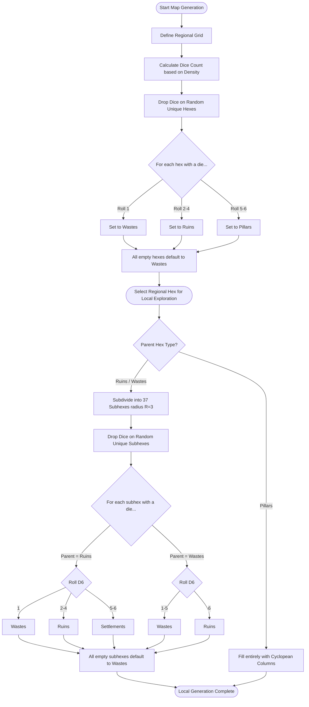

# Generating the Vast: Hexcrawl Generation Algorithm

This document details the mechanics and procedural rules for generating hexcrawl maps at both the **Regional Scale** and **Local Scale**, based on the rules and diagrams from the provided design documents.

---

## 1. Concept Overview

The map is generated dynamically at two nested scales to support low-prep, interactive exploration:
1. **Regional Scale (6-mile hexes)**: Focuses on macro-level landscapes and major terrain features (**Wastes**, **Ruins**, and **Pillars**).
2. **Local Scale (1-mile hexes)**: Focuses on micro-level exploration inside a single 6-mile regional hex, detailing specific environments (**Wastes**, **Ruins**, and **Settlements**).

---

## 2. Regional Scale Generation

### Rules:
1. **Grid Setup**: A standard grid of **flat-topped** hexes is created with dimensions **10 columns wide by 8 rows high** (80 hexes total). Each hex represents **6 miles** of distance.
2. **Dice Drop Method**: Exactly **8 dice** (D6s, representing a "handful") are rolled and dropped onto the map:
   - Each die occupies **exactly 1 unique hex** (no two dice can occupy the same hex).
   - Each die shows a random value from **1 to 6**.
3. **Terrain Assignment**:
   - For every hex that receives a die, its terrain is determined by the face-up value of that die:
     - **1**: **Wastes** — Barren swaths of grey dust and sand, prone to sandstorms and filled with little.
     - **2–4**: **Ruins** — Hives of erratic and crumbling architecture, sometimes populated with life.
     - **5–6**: **Pillars** — Enormous towers of stone that stretch miles across and reach up to an unseen ceiling.
   - **All remaining hexes** (where no die landed) default to **Wastes**.

---

## 3. Local Scale Generation

Each regional hex can be subdivided into a local map for granular exploration.

### Rules:
1. **Grid Setup**: A hexagonal subgrid of **37 flat-topped subhexes** (radius $R=3$, spanning 6 miles flat-edge to flat-edge) is created. Each subhex represents **1 mile**.
2. **Dice Drop Method**: A D6 is rolled to determine the density and number of dice to drop on this local map:
   - **1–3 (Barren)**: Drop **6 dice**.
   - **4–5 (Standard)**: Drop **12 dice**.
   - **6 (Plentiful)**: Drop **32 dice**.
   Each die occupies **exactly 1 unique subhex** (max 1 die per subhex) and shows a random value from **1 to 6**.
3. **Terrain Assignment**:
   - The terrain of the subhexes depends on the **face-up value of the die** and the **parent regional hex type**:
     
     | D6 Roll | Parent is RUINS | Parent is WASTES |
     | :---: | :--- | :--- |
     | **1** | Wastes | Wastes |
     | **2–4** | Ruins | Wastes |
     | **5** | Settlements | Wastes |
     | **6** | Settlements | Ruins |
     
   - **All remaining subhexes** default to **Wastes**.
   
4. **Pillars Special Case**:
   - If the parent regional hex is **Pillars**, the local scale is filled entirely with massive cyclopean columns (with custom exploration rules as detailed on page 12).

---

## 4. Visualizing the Flow



---

## 5. Algorithmic Pseudo-code

Let's express the generation flow as structured pseudo-code.

### Data Structures & Constants

```python
# Constants
REGIONAL_HEX_MILES = 6
LOCAL_SUBHEX_MILES = 1
LOCAL_GRID_RADIUS = 3 # Generates 37 hexes

enum TerrainType:
    WASTES
    RUINS
    PILLARS
    SETTLEMENTS

class Hex:
    axial_q: int
    axial_r: int
    terrain: TerrainType

class RegionalHex extends Hex:
    local_map: LocalGrid # Lazily generated when visited

class LocalGrid:
    subhexes: List[Hex] # 37 subhexes representing 1-mile units
    parent_type: TerrainType
```

### Regional Generation Function

```python
function generate_regional_map() -> List[RegionalHex]:
    # Initialize the standard 8x10 regional grid (10 columns wide, 8 rows high)
    width = 10
    height = 8
    regional_grid = []
    for r from 0 to height - 1:
        for q from -floor(r/2) to width - 1 - floor(r/2):
            hex = new RegionalHex(q, r, TerrainType.WASTES)
            regional_grid.append(hex)
            
    # Drop exactly 8 dice onto the grid (max 1 die per hex)
    dice_count = 8
    
    # Pick random unique hexes to receive dice
    hexes_with_dice = sample_without_replacement(regional_grid, dice_count)
    
    # Assign terrain based on D6 rolls
    for hex in hexes_with_dice:
        roll = roll_d6()
        if roll == 1:
            hex.terrain = TerrainType.WASTES
        elif roll >= 2 and roll <= 4:
            hex.terrain = TerrainType.RUINS
        elif roll >= 5 and roll <= 6:
            hex.terrain = TerrainType.PILLARS
            
    # All other hexes remain TerrainType.WASTES (already initialized)
    return regional_grid
```

### Local Generation Function

```python
function generate_local_map(parent_hex: RegionalHex) -> LocalGrid:
    local_grid = new LocalGrid()
    local_grid.parent_type = parent_hex.terrain
    
    # If the parent is a Pillars hex, it is fully covered in Pillars (custom rules)
    if parent_hex.terrain == TerrainType.PILLARS:
        # Fill the entire grid of 37 hexes with Pillars
        for q from -LOCAL_GRID_RADIUS to LOCAL_GRID_RADIUS:
            for r from -LOCAL_GRID_RADIUS to LOCAL_GRID_RADIUS:
                if abs(q) <= LOCAL_GRID_RADIUS and abs(r) <= LOCAL_GRID_RADIUS and abs(q + r) <= LOCAL_GRID_RADIUS:
                    subhex = new Hex(q, r, TerrainType.PILLARS)
                    local_grid.subhexes.append(subhex)
        return local_grid
        
    # Generate the 37 empty subhexes for Wastes or Ruins parent
    for q from -LOCAL_GRID_RADIUS to LOCAL_GRID_RADIUS:
        for r from -LOCAL_GRID_RADIUS to LOCAL_GRID_RADIUS:
            if abs(q) <= LOCAL_GRID_RADIUS and abs(r) <= LOCAL_GRID_RADIUS and abs(q + r) <= LOCAL_GRID_RADIUS:
                # Default all to WASTES
                subhex = new Hex(q, r, TerrainType.WASTES)
                local_grid.subhexes.append(subhex)
                
    # Roll a D6 to determine local dice density
    density_roll = roll_d6()
    if density_roll >= 1 and density_roll <= 3:
        dice_count = 6   # Barren
    elif density_roll == 4 or density_roll == 5:
        dice_count = 12  # Standard
    elif density_roll == 6:
        dice_count = 32  # Plentiful
        
    # Roll and drop dice onto the subgrid
    total_subhexes = length(local_grid.subhexes)
    dice_count = min(dice_count, total_subhexes)
    subhexes_with_dice = sample_without_replacement(local_grid.subhexes, dice_count)
    
    # Resolve terrain based on parent type and D6 roll
    for subhex in subhexes_with_dice:
        roll = roll_d6()
        if parent_hex.terrain == TerrainType.RUINS:
            if roll == 1:
                subhex.terrain = TerrainType.WASTES
            elif roll >= 2 and roll <= 4:
                subhex.terrain = TerrainType.RUINS
            elif roll >= 5 and roll <= 6:
                subhex.terrain = TerrainType.SETTLEMENTS
                
        elif parent_hex.terrain == TerrainType.WASTES:
            if roll >= 1 and roll <= 5:
                subhex.terrain = TerrainType.WASTES
            elif roll == 6:
                subhex.terrain = TerrainType.RUINS
                
    # All remaining subhexes remain TerrainType.WASTES (already initialized)
    return local_grid
```
