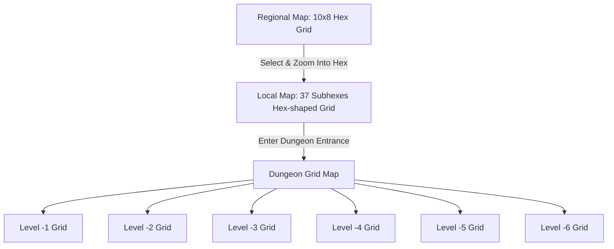

# Implementation Plan - 3-Layer Map Component (Godot 4 + C#)

This plan details the design and implementation of a top-down, multi-scale mapping component (Regional, Local, and Dungeon) using Godot 4 and C# with the exact specifications provided by the user.

## Architecture & System Overview

We will create a clean, responsive 3-layer map with smooth transitions and high-fidelity aesthetics.

### 1. The Three Map Layers

1. **Regional Map (8 hexes high by 10 hexes wide)**
   - Grid size: 10 columns by 8 rows of pointy-topped hexes.
   - Coordinate layout: Pointy-topped odd-r or axial coordination.
   - Contains varied biomes (e.g. plains, forests, mountains, water, swamps) and locations of interest (like dungeon entrances).

2. **Local Map (6 subhexes across, flat-edge to flat-edge)**
   - Each regional hex contains a local map.
   - A local map is a hex-shaped grid that is exactly **6 subhexes across from flat-edge to flat-edge** (horizontal width for pointy-topped hexes, meaning a radius $R=3$ where coordinates $q, r, s$ satisfy $|q| \le 3, |r| \le 3, |q+r| \le 3$, giving a total of 37 subhexes).
   - Each subhex represents a **1-mile** hex.
   - Contains local terrain details (e.g., roads, campsites, rivers, landmarks, and the dungeon entrance itself).

3. **Dungeon Map (Up to 6 levels deep)**
   - Entered from a dungeon entrance on a local subhex.
   - Grid-based map (rectangular grid, e.g., 20 columns by 15 rows) representing corridors, rooms, walls, doors, stairs, and chests.
   - Supports **6 levels deep** (Floor -1 to Floor -6).
   - Vertical level selector allows switching between floors.



---

## Technical Architecture

### Component Diagram

```
d:/Code/VastDark/Gemini/
├── project.godot                # Godot project file
├── VastDark.csproj              # C# project settings
├── VastDark.sln                 # C# solution file
├── src/
│   ├── Main.tscn                # Main Godot Scene
│   ├── Main.cs                  # Main Entry Controller
│   ├── Common/
│   │   ├── HexCoords.cs         # Hex coordinate math (axial + offset helper)
│   │   └── MapScale.cs          # Enum for Regional, Local, Dungeon
│   ├── Models/
│   │   ├── HexTile.cs           # Representation of a single hex/subhex
│   │   ├── MapData.cs           # Holds regional and local grid models
│   │   └── DungeonLevel.cs      # Dungeon room layout models (6 floors)
│   ├── Generation/
│   │   └── MockGenerator.cs     # Temporary generators for testing the 3 layers
│   ├── View/
│   │   ├── MapRenderer.cs       # Custom Node2D that handles drawing all scales
│   │   └── CameraController.cs  # Smooth camera pan and zoom controller
│   └── UI/
│       ├── GameUI.cs            # HUD logic (Scale switcher, breadcrumbs, floor lists)
│       └── GameUI.tscn          # Game HUD controls
```

---

## Detailed Components

### 1. Hex Coordinates & Geometry (`HexCoords.cs`)
We will use **pointy-topped hexes** with axial coordinates $(q, r)$ and cubic relations $q + r + s = 0$.
- **Regional Grid**: 10 columns by 8 rows. Represented internally using offset coordinates (odd-r layout) mapped to axial:
  - $q = col - \lfloor row / 2 \rfloor$
  - $r = row$
- **Local Grid**: Hexagonal boundary.
  - $|q| \le 3$, $|r| \le 3$, and $|q+r| \le 3$ (yielding 37 subhexes, spanning 6 subhexes flat-edge to flat-edge).
- **Pixel Mapping**:
  - Center of hex $q, r$ in world pixels:
    - $x = \text{size} \times \sqrt{3} \times (q + r/2)$
    - $y = \text{size} \times 3/2 \times r$
  - Where $\text{size}$ is the radius of the circumcircle.

### 2. Custom Node2D Drawing (`MapRenderer.cs`)
To achieve premium visuals, we will use Godot's native C# drawing API (`_Draw()`) inside a Node2D:
- **Clean Neon Lines**: Hex grid lines drawn dynamically with anti-aliasing.
- **Color Gradients**: Fill hexes with nice modern HSL/dark-mode colors (e.g. deep forest green, dark mountain gray, glowing cyan dungeon entrance, soft blue ocean).
- **Hover & Selection**: Draw animated bounding outlines around selected/hovered hexes.
- **Symbols**: Simple vector shapes drawn for point-of-interests (e.g., castle, city, dungeon entrance, stairs, chest, walls, doors).

### 3. Navigation & State Controller (`Main.cs`)
- Handles scale transitions:
  - **Regional -> Local**: Zooming in or double-clicking on a regional hex loads that regional hex's local map and centers the camera.
  - **Local -> Dungeon**: Moving or clicking on a local subhex with a dungeon entrance zooms into the 6-floor grid-based dungeon map.
  - **Breadcrumbs UI**: Provides a clean path at the top (e.g., `World Map [10x8] > Hex (3, 2) [Local] > Dungeon [Level -3]`) to easily click and scale back up.

### 4. Game UI (`GameUI.cs` & `GameUI.tscn`)
- Modern dark-mode panels:
  - **Inspector Panel**: Shows coordinates, biome details, size of the subhex (e.g. "1 Mile"), and level indices.
  - **Dungeon Level Selector**: Displays a vertical stack of buttons (Level -1 to Level -6) to change the floor when in Dungeon view.
  - **Navigation Panel**: Buttons to zoom in/out, reset camera, or scale back.

---

## User Review Required

> [!IMPORTANT]
> 1. **Local Map Geometry**: We are using pointy-topped hexes of radius $R=3$ (having $|q|, |r|, |q+r| \le 3$) which provides a hexagonal shape of exactly 37 subhexes. Measuring flat-edge to flat-edge (from left to right) gives exactly 6 steps (6 miles).
> 2. **Dungeon Grid**: We will represent the dungeon as a grid-based room system (e.g., 20x15 cells) with 6 stacked vertical floors (Levels -1 to -6).
> 3. **Procedural Content**: For this mapping phase, we will implement simple mock procedural generators (generating basic biomes, a dungeon entrance on the local map, and random rooms on dungeon floors) to demonstrate the mapping controls. Once you approve the mapping structure, we will add the rich procedural generation content.

---

## Verification Plan

### Automated Checks
- Compiling the C# project using `dotnet build` in PowerShell to ensure 100% correct code without compiler warnings or issues.

### Manual Verification
- Open in Godot 4.3 (with .NET), press `F5` to run, and verify:
  1. Smooth camera pan (WASD or mouse drag) and scroll wheel zoom.
  2. Double-click a regional hex to zoom into its local 6-mile map.
  3. Double-click the local subhex containing the dungeon entrance to load the 6-level dungeon grid.
  4. Use the vertical floor switcher to change dungeon levels (-1 to -6).
  5. Use breadcrumbs UI to scale back up to Local or Regional view.
